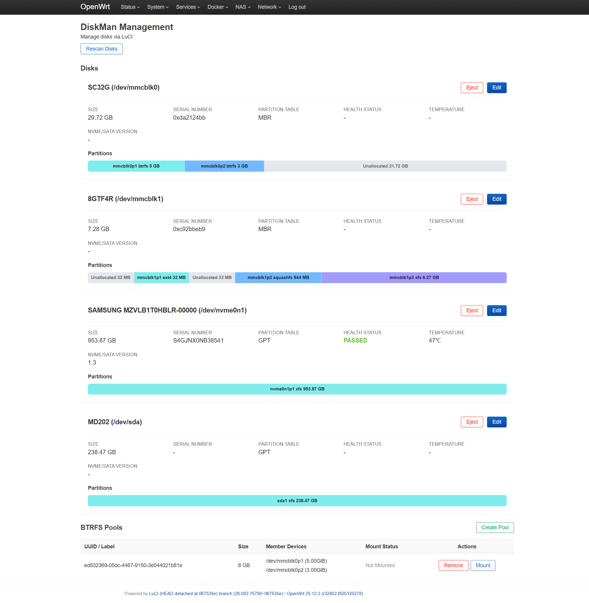

# luci-app-diskman

A lightweight disk management plugin for LuCI that enables basic operations such as partitioning, formatting, and mounting directly via the web interface. It also supports BTRFS RAID management and provides real-time disk health and SMART information.

## Prerequisites

The underlying scripts for this plugin rely on **ucode**, which requires **OpenWrt 24.10** or a newer version.

## Supported File Systems

- ext4 (including ext2/3)
- btrfs
- xfs
- f2fs
- ntfs
- vfat (fat16/fat32)
- exfat
- swap (swap partition)

**Note:** Formatting partitions as NTFS requires the `ntfs-3g-utils` package.

## Compilation

To include this plugin in your OpenWrt build, clone the source code into your OpenWrt source `package` directory,then select it via `make menuconfig`:

```bash
git clone https://github.com/sbwml/luci-app-diskman package/new/luci-app-diskman

make menuconfig # Navigate to LuCI -> 3. Applications -> luci-app-diskman

make package/new/luci-app-diskman/compile V=s
```

## Screenshots



## Credits

- https://github.com/lisaac/luci-app-diskman
